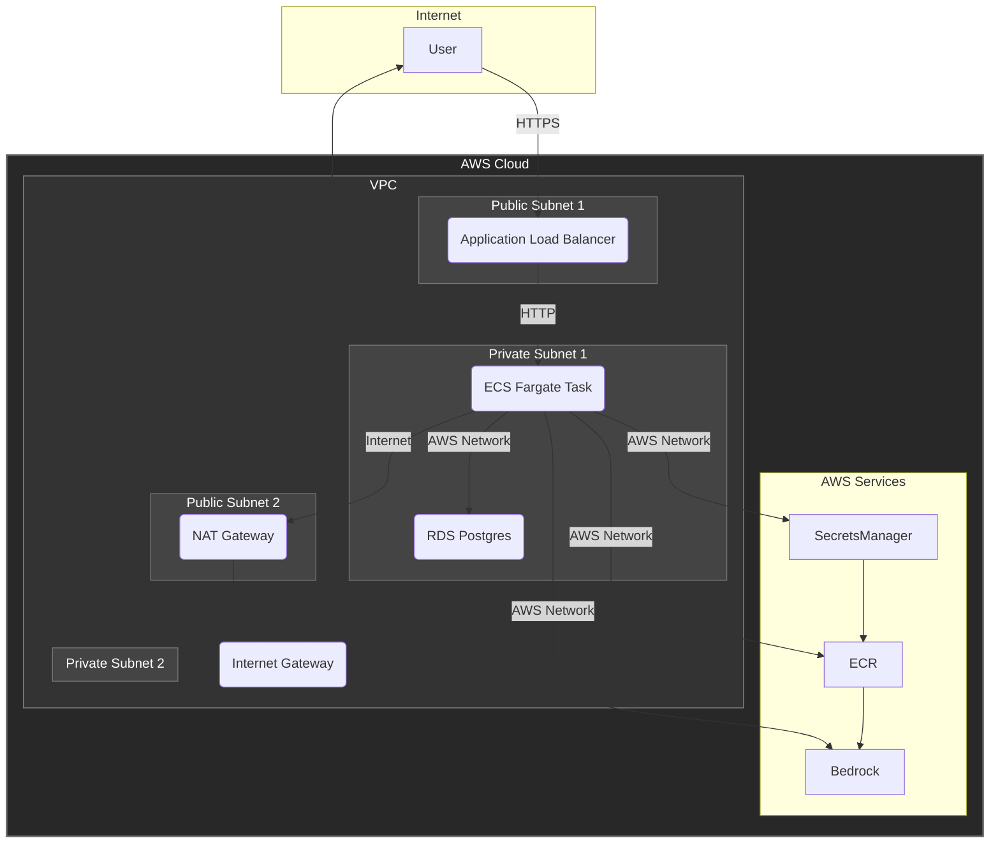

```mermaid
graph TD
    %% Define styles first using the compatible classDef syntax
    classDef awsCloud fill:#282828,stroke:#666,stroke-width:2px,color:#fff;
    classDef vpcStyle fill:#333,stroke:#888,stroke-width:1px,color:#fff;
    classDef subnetStyle fill:#444,stroke:#777,stroke-width:1px,color:#fff;

    %% --- Top Level Containers ---
    subgraph "Internet"
        User
    end

    subgraph AWS_Cloud["AWS Cloud"]
        subgraph AWS_Services["AWS Services"]
            direction TB
            SecretsManager --> ECR --> Bedrock
        end

        subgraph VPC
            IGW("Internet Gateway")

            subgraph Public_Subnet_1["Public Subnet 1"]
                ALB("Application Load Balancer")
            end
            
            subgraph Private_Subnet_1["Private Subnet 1"]
                ECS_Task("ECS Fargate Task")
                RDS_DB("RDS Postgres")
            end

            subgraph Public_Subnet_2["Public Subnet 2"]
                NAT("NAT Gateway")
            end
            
            subgraph Private_Subnet_2["Private Subnet 2"]
                %% Logically empty to represent HA
            end
        end
    end

    %% --- Style Assignments (Corrected) ---
    class AWS_Cloud awsCloud;
    class VPC vpcStyle;
    class Public_Subnet_1 subnetStyle;
    class Private_Subnet_1 subnetStyle;
    class Public_Subnet_2 subnetStyle;
    class Private_Subnet_2 subnetStyle;
    
    %% --- Connections ---
    User -- HTTPS --> ALB
    User <--> IGW
    
    ALB -- HTTP --> ECS_Task
    
    ECS_Task -- "Internet" --> NAT
    NAT --> IGW
    
    ECS_Task -- "AWS Network" --> RDS_DB
    
    ECS_Task -- "AWS Network" --> SecretsManager
    ECS_Task -- "AWS Network" --> ECR
    ECS_Task -- "AWS Network" --> Bedrock
```