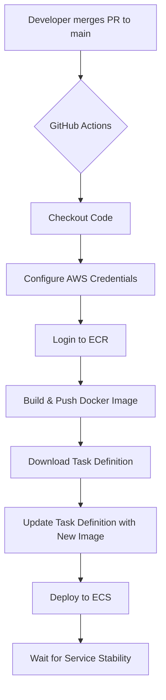

```mermaid
graph TD
    A[Developer merges PR to main] --> B{GitHub Actions};
    B --> C[Checkout Code];
    C --> D[Configure AWS Credentials];
    D --> E[Login to ECR];
    E --> F[Build & Push Docker Image];
    F --> G[Download Task Definition];
    G --> H[Update Task Definition with New Image];
    H --> I[Deploy to ECS];
    I --> J[Wait for Service Stability];
```
