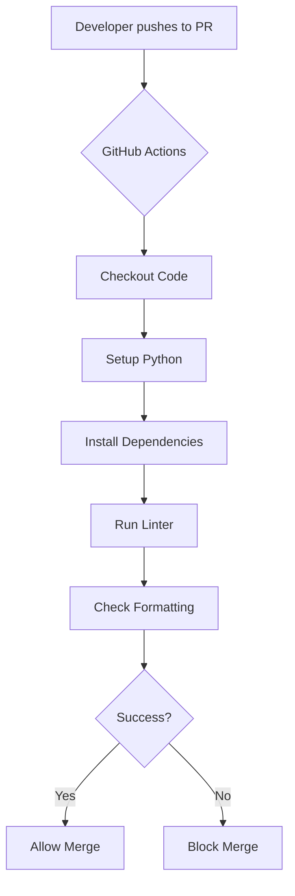

```mermaid
graph TD
    A[Developer pushes to PR] --> B{GitHub Actions};
    B --> C[Checkout Code];
    C --> D[Setup Python];
    D --> E[Install Dependencies];
    E --> F[Run Linter];
    F --> G[Check Formatting];
    G --> H{Success?};
    H -- Yes --> I[Allow Merge];
    H -- No --> J[Block Merge];
```
