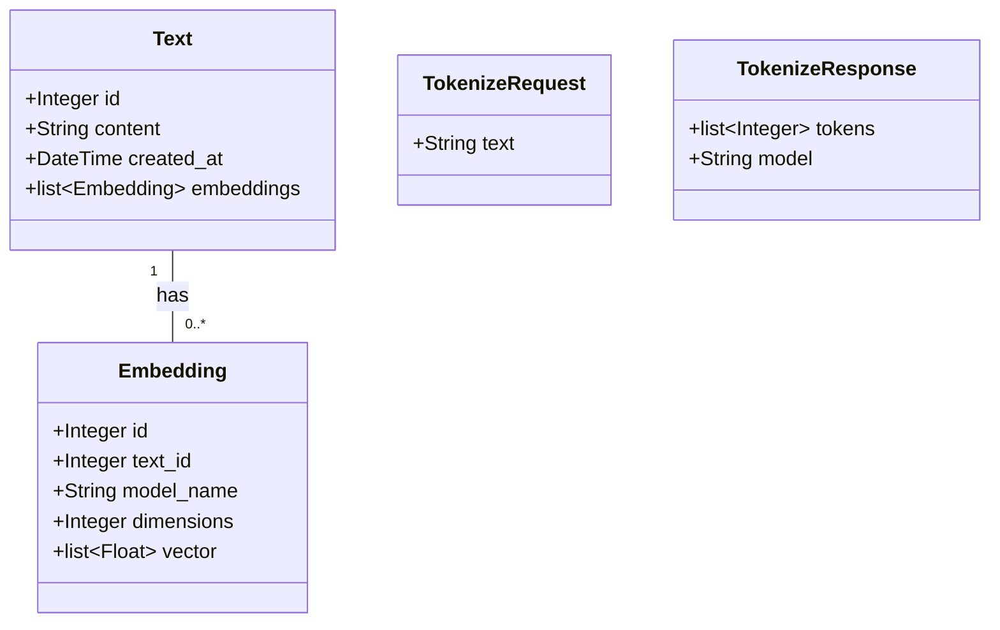

```mermaid
classDiagram
    class Text {
        +Integer id
        +String content
        +DateTime created_at
        +list~Embedding~ embeddings
    }
    class Embedding {
        +Integer id
        +Integer text_id
        +String model_name
        +Integer dimensions
        +list~Float~ vector
    }
    class TokenizeRequest {
        +String text
    }
    class TokenizeResponse {
        +list~Integer~ tokens
        +String model
    }
    Text "1" -- "0..*" Embedding : has
```