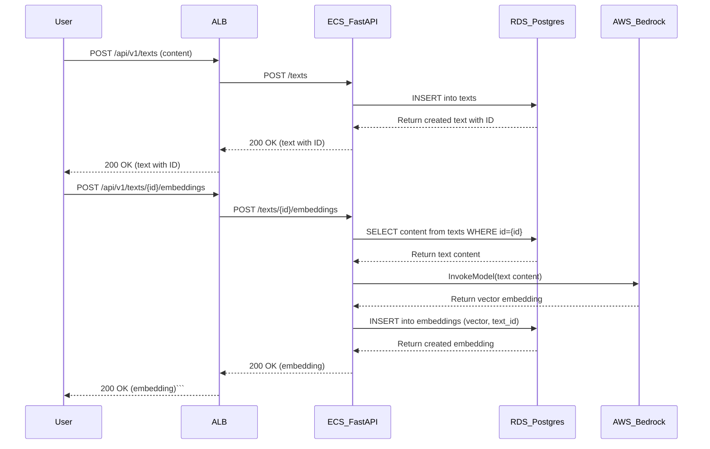

```mermaid
sequenceDiagram
    participant User
    participant ALB
    participant ECS_FastAPI
    participant RDS_Postgres
    participant AWS_Bedrock

    User->>ALB: POST /api/v1/texts (content)
    ALB->>ECS_FastAPI: POST /texts
    ECS_FastAPI->>RDS_Postgres: INSERT into texts
    RDS_Postgres-->>ECS_FastAPI: Return created text with ID
    ECS_FastAPI-->>ALB: 200 OK (text with ID)
    ALB-->>User: 200 OK (text with ID)

    User->>ALB: POST /api/v1/texts/{id}/embeddings
    ALB->>ECS_FastAPI: POST /texts/{id}/embeddings
    ECS_FastAPI->>RDS_Postgres: SELECT content from texts WHERE id={id}
    RDS_Postgres-->>ECS_FastAPI: Return text content
    ECS_FastAPI->>AWS_Bedrock: InvokeModel(text content)
    AWS_Bedrock-->>ECS_FastAPI: Return vector embedding
    ECS_FastAPI->>RDS_Postgres: INSERT into embeddings (vector, text_id)
    RDS_Postgres-->>ECS_FastAPI: Return created embedding
    ECS_FastAPI-->>ALB: 200 OK (embedding)
    ALB-->>User: 200 OK (embedding)```
```